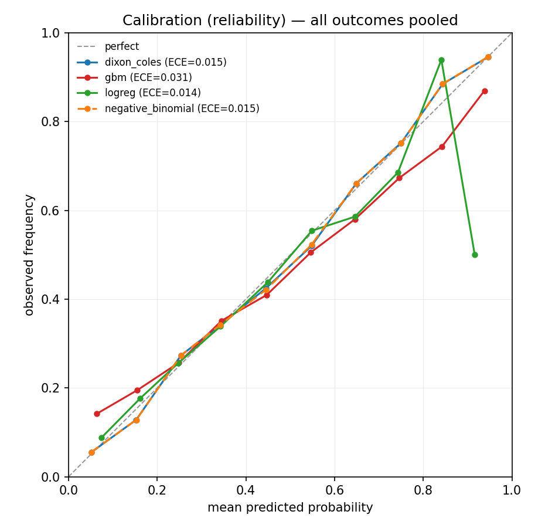
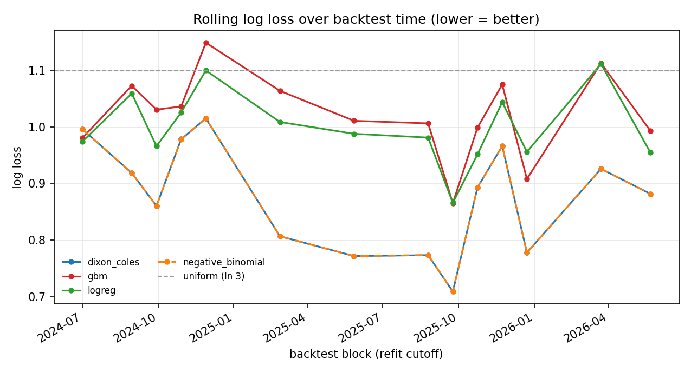
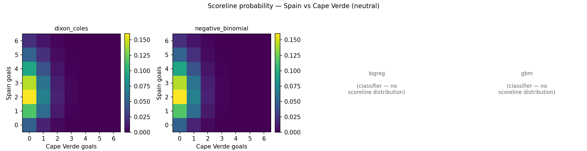

# goal-model — structured vs. flexible models under sparse sports data

**This project tests whether structured probabilistic models outperform flexible ML baselines under sparse, noisy sports-event data.**

It is a calibration-first forecasting study, not a tipster. The question is not
"who wins?" but "are the *probabilities* honest, and which modelling choices
actually earn their complexity?"

## The problem

International football is a hard forecasting regime: a few thousand matches,
heavy noise, strong irreducible randomness, and teams that play each other
rarely. In that regime the goal is not to nail scorelines — it is to produce
**well-calibrated probabilities** (a "70%" should happen ~70% of the time) and
to learn *where interpretable statistical assumptions hold* and *where a flexible
ML model stops adding value and starts overfitting*.

The interesting cases are precisely the sparse, over-dispersed, low-signal ones,
which is why the lessons here transfer to other sparse event-count problems —
credit default, fraud detection, insurance claims — where the same tension
between a structured generative model and a flexible discriminative one recurs.

**Setup.** Four models are compared on identical fixtures:

- **`dixon_coles`** — the structured incumbent: a Dixon-Coles bivariate-Poisson
  goal model, per-team attack/defence ratings fit by time-weighted MLE.
- **`negative_binomial`** — same mean structure, but over-dispersed (NB) goal
  counts, to test the "goals are over-dispersed" hypothesis directly.
- **`logreg`** / **`gbm`** — logistic regression and gradient-boosted trees on
  pre-match form features (recent attack/defence, points, rest days), the
  flexible-ML side of the comparison.

All four run through one **leakage-free rolling-origin backtest**: refit on a
30-day cadence, each block trained strictly on matches *before* its cutoff
(including the "team has ≥ N games" universe filter, re-derived per cutoff), then
scored on matches *in* the block. ~1,840 out-of-sample fixtures, 2024-07 → 2026.

## Calibration — the core diagnostic



A point on the dashed line means a forecast of *p* happened *p* of the time.
**Dixon-Coles (blue) and the NB variant (orange, dashed over it) hug the
diagonal** (ECE ≈ 0.015); the **gradient-boosted model (red) is visibly
over-confident** at the high end — it says ~0.95 where ~0.87 actually occurs.
Logistic regression is decently calibrated but, as the scores below show, less
*sharp* — calibration alone does not separate it from Dixon-Coles, the proper
scoring rules do.

## Out-of-sample leaderboard (block-bootstrap 95% CIs)

Scored on the 1,843 fixtures every model could predict. CIs come from a **block
bootstrap that resamples whole refit blocks** (2,000 reps), so correlated
within-block fixtures don't inflate apparent precision. Lower is better
everywhere except accuracy.

| model | log loss (95% CI) | Brier (95% CI) | RPS (95% CI) | exact-NLL | ECE (home) | acc |
|---|---|---|---|---|---|---|
| **dixon_coles** | **0.858 [0.813, 0.906]** | **0.504 [0.476, 0.534]** | **0.329 [0.309, 0.350]** | 2.840 | 0.021 | 0.600 |
| negative_binomial | 0.858 [0.813, 0.906] | 0.504 [0.476, 0.534] | 0.329 [0.309, 0.350] | 2.840 | 0.020 | 0.599 |
| logreg | 0.994 [0.959, 1.028] | 0.594 [0.570, 0.618] | 0.413 [0.394, 0.431] | — | 0.028 | 0.524 |
| gbm | 1.020 [0.981, 1.053] | 0.606 [0.581, 0.629] | 0.421 [0.401, 0.440] | — | 0.038 | 0.508 |
| baseline_uniform | 1.099 | 0.667 | 0.476 | — | 0.138 | 0.471 |

Paired differences (the honest test — does the gap survive the time structure?):

| comparison | Δ log loss | 95% CI | verdict |
|---|---|---|---|
| dixon_coles − logreg | −0.136 | [−0.169, −0.098] | **significant** |
| dixon_coles − gbm | −0.162 | [−0.196, −0.124] | **significant** |
| dixon_coles − negative_binomial | +0.000 | [−0.000, +0.000] | **not significant** |

(`exact-NLL` is the negative log-likelihood of the realised scoreline; it is only
defined for the goal models, which emit a full score distribution — the 1X2
classifiers show "—" by design.)

## What the results mean

The structured parametric model wins, and the win is statistically real: against
both ML baselines the log-loss gap excludes zero under the block bootstrap. This
is a finding about **when *not* to reach for the complex model** — not a
"I used a fancier method, so I'm more accurate" claim. With a few thousand noisy
matches and lightweight features, encoding the right structure (teams have
attack/defence ratings; goals are roughly Poisson; home advantage and a low-score
correction exist) beats letting trees discover structure from scratch.

The skill is also temporally stable rather than an artefact of one lucky stretch:



The goal models sit below both baselines in essentially every block. Note the
project does **not** smooth over the rough patches — around 2024-12 and 2026-04
*every* model spikes toward the uniform line (ln 3 ≈ 1.10): thin, friendly-heavy
windows where there is simply little signal. Those spikes are kept in, because a
forecaster that hides its bad weeks is not one to trust.

## Limitations (please read)

- **The negative-binomial extension did not provide measurable improvement**,
  suggesting much of the observed marginal overdispersion is already absorbed by
  match-level team-strength variation. (Raw goals show variance ≈ 2.07 vs. mean
  ≈ 1.33, but the fitted NB dispersion lands at `r ≈ 1450`, effectively Poisson,
  and NB is statistically indistinguishable from Dixon-Coles — see the paired
  CI above and the near-identical scoreline matrices below.)
- **With the available lightweight pre-match features, flexible ML baselines
  underperformed the structured Dixon-Coles model. This suggests model structure
  can be more valuable than flexibility when feature richness and sample size are
  limited.** Whether richer features (player availability, opponent-adjusted
  expected goals, competition tier) would close the gap is an open question this
  study does not settle.
- **The market baseline is currently an interface only.** `devig_probs` is
  implemented and wired into the evaluator, but no real closing-odds feed is
  connected yet, so "beat the market" — the genuinely hard bar — is not yet
  tested. Until then, beating `uniform` and the ML baselines is the available
  evidence, not market efficiency.
- **Calibration ≠ ranking skill.** Logistic regression is nearly as calibrated as
  Dixon-Coles (ECE) yet clearly worse on every proper scoring rule; calibration
  is necessary, not sufficient. Both are reported for exactly this reason.
- *(Resolved)* An earlier **selection-time leak** — building the team universe
  from whole-dataset match counts — has been fixed; the filter is now re-derived
  per cutoff from past-only matches. It moved the shared-fixture set
  (1,928 → 1,843) but left the headline metrics essentially unchanged.

## Scoreline distributions (illustration)



The two goal models produce **near-identical** score matrices — the visual
counterpart of their indistinguishable metrics. The 1X2 classifiers have no
panel because they do not model a scoreline distribution at all; they only emit
P(home/draw/away). That difference in *what is being modelled* is part of why the
exact-NLL column applies to only two of the four models.

## Reproduce (one command)

```bash
pip install -r requirements.txt
python scripts/backtest_report.py
```

This runs the full leakage-free backtest, prints the leaderboard and bootstrap
CIs, writes `backtest_results/{predictions_all_models,model_comparison,ci_table,diff_table}`,
and regenerates all three figures in `figures/`. (`python evaluation/plots.py`
rebuilds the figures alone from the saved predictions.)

```
src/dixoncoles.py              core goal model: MLE attack/defence + scoreline
src/data.py                    load, time-decay weights, per-cutoff team filter
models/base.py                 the shared ForecastModel contract
models/negative_binomial.py    over-dispersed (NB) goal model
models/ml_baselines.py         logistic + gradient-boosted 1X2 baselines
backtest/rolling_backtest.py   walk-forward, no-leakage evaluation harness
evaluation/metrics.py          log loss, Brier, RPS, exact-NLL, calibration, block bootstrap
evaluation/plots.py            calibration, rolling-log-loss, scoreline figures
scripts/backtest_report.py     one-command report: backtest -> metrics -> figures
data/results.csv               martj42/international_results (public, CC0)
```

## Credits

- Data: martj42/international_results (CC0).
- Method: Dixon & Coles (1997), *Modelling Association Football Scores and
  Inefficiencies in the Football Betting Market.*

*A probabilistic-forecasting and market-efficiency research project. No betting
integration, no position sizing, no wagering advice — by design.*
